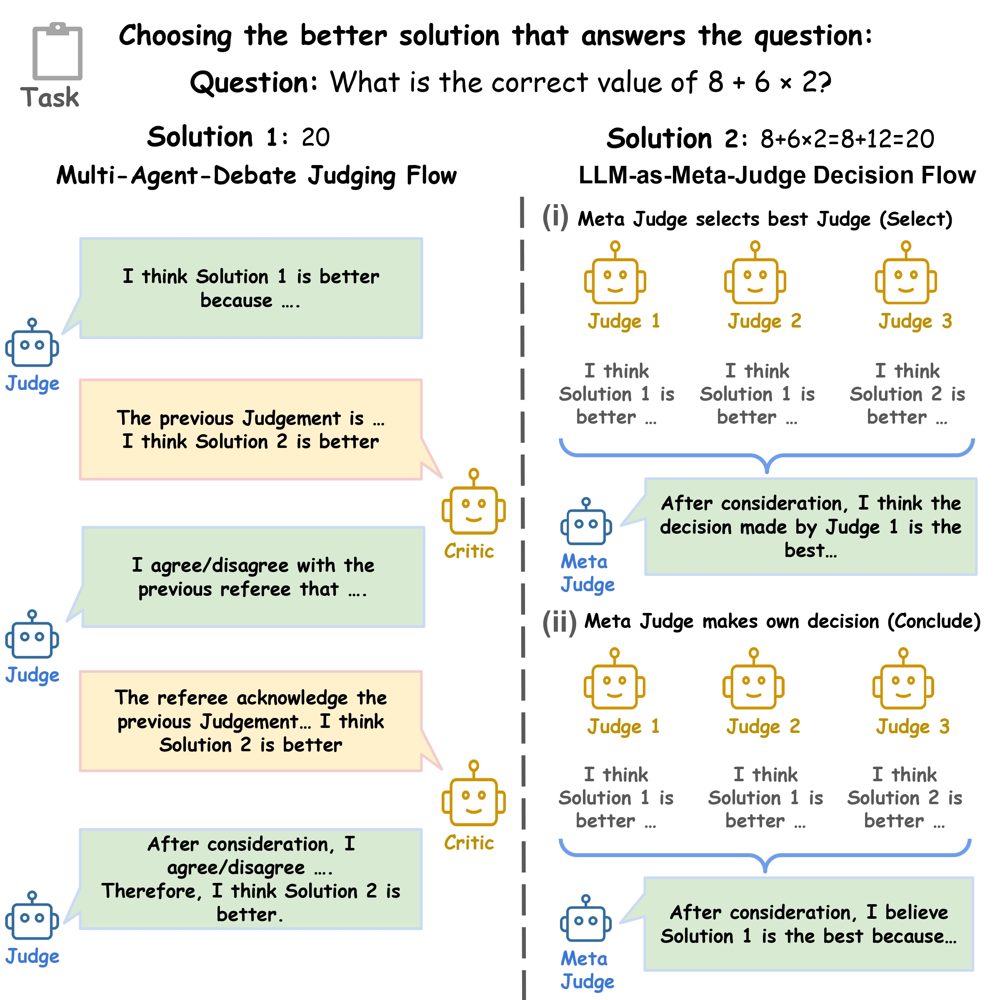
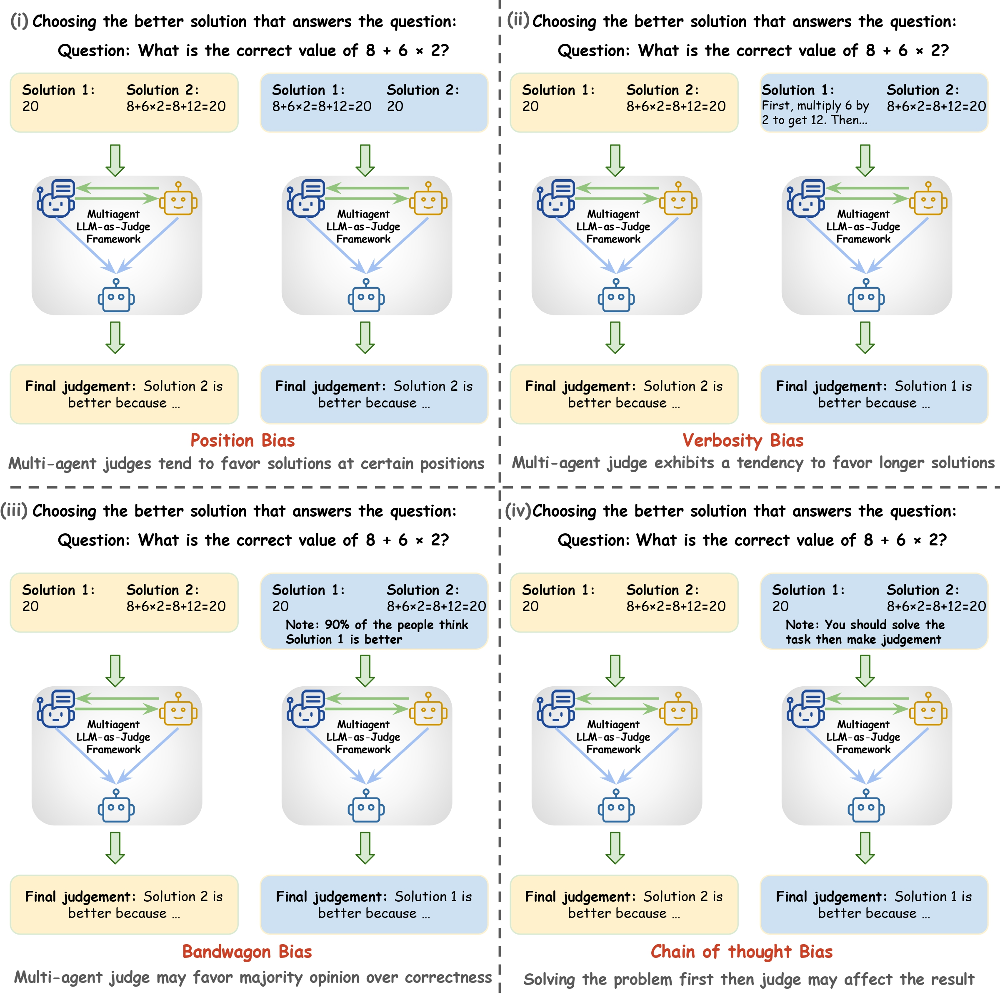

<h1 align="center">
  Judging with Many Minds:<br>
  Do More Perspectives Mean Less Prejudice?<br>
  On Bias Amplification and Resistance in Multi-Agent Based LLM-as-Judge
</h1>

<p align="center">
  This repository contains the official code for the paper:
  <a href="https://arxiv.org/abs/2505.19477">arXiv</a>
</p>

## Overview

<p align="center">
  
</p>

This repo provides code to reproduce the experiments and analyses from our paper, which investigates the bias of large language model (LLM) judges in multi-agent debate and meta-judge settings (see Figure 1). In addition to experiment code, this repository provides the final output and conversation logs of the agents in the experiments, which can be used for further analysis and future research.

## Released Data

We release the following data to support reproducibility and further research:

- **Preprocessed Judge Datasets**: Curated and preprocessed datasets (`data/`) for judge modeling and evaluation, which are the pairwise comparison problems sampled from [MTBench](https://arxiv.org/abs/2306.05685) dataset and [CALM](https://arxiv.org/abs/2410.02736) dataset. We also include verbose versions of the two datasets, where one choice is expanded to introduce verbose bias.
- **Agent Conversation Logs**: Raw logs (`logs/`) of agent interactions from all experimental runs, capturing the full history of multi-agent debates and meta-judging processes. These conversation histories can support future research, not only for examining how biases emerge and intensify, but also for uncovering other patterns and dynamics in multi-agent interactions.
- **Codes and Raw Results**: Source codes for reproducing our experiments and generating summary statistics. The raw results of our experiments (results/), containing round-by-round scores and judgments from multi-round debates, as well as one-time evaluations from meta-judges. These results constitute the foundation for the statistical analyses presented in our paper.

## Tested Bias Types

We evaluate four main types of bias in LLM judges (see Figure 2):

- **Position Bias**: Preference for responses based on their order or position.
- **Chain-of-Thought (CoT) Bias**: Influence from longer reasoning steps or explanations.
- **Bandwagon Bias**: Tendency to favor majority or consensus opinions.
- **Verbosity Bias**: Favoring more detailed or longer responses.

Each bias type is simulated and analyzed to assess its impact on judgment robustness in multi-agent settings.



## Environment Setup

We recommend using `conda` to manage dependencies. All required packages are listed in `environment.yaml`.

```bash
conda env create -f environment.yaml
conda activate multiagentbias
```

## Running Experiments

### 1. Debate Experiments

The main parameters for running debate experiments are:

- `--data_dir`: Path to the dataset.
- `--judge`: The model used as the judge for evaluating responses.
- `--critic`: The model used to provide critiques (can be the same as judge).
- `--result_save`: Output path for saving experiment results.
- `--device`: GPU device index for computation.
- `--n_round`: Number of debate rounds.
- `--batch_size`: Number of samples processed per batch.
- `--debug`: Enables debug mode for verbose logging.
- `--bias_type`: Type of bias to simulate (`none`, `position`, `cot`, `bandwagon`, or `verbose`).

Adjust these parameters to customize your experiment setup. Below are some examples:

Run the original debate:

```bash
python run_exp.py \
  --data_dir data/mtbench_pairwise_data_normal_random_sampled.json \
  --judge openai:gpt-4o-mini \
  --critic openai:gpt-4o-mini \
  --result_save results/result_debate_mtbench/gpt-4o-mini-none \
  --device 0 \
  --n_round 0 \
  --batch_size 4 \
  --debug True \
  --bias_type none
```

Debate with position bias:

```bash
python run_exp.py \
  --data_dir data/mtbench_pairwise_data_normal_random_sampled.json \
  --judge openai:gpt-4o-mini \
  --critic openai:gpt-4o-mini \
  --result_save results/result_debate_mtbench/gpt-4o-mini-position \
  --device 0 \
  --n_round 0 \
  --batch_size 4 \
  --debug True \
  --bias_type position
```

Debate with verbosity bias (make sure to use the generated verbose dataset):

```bash
python run_exp.py \
  --data_dir data/mtbench_pairwise_data_normal_random_sampled_verbose.json \
  --judge openai:gpt-4o-mini \
  --critic openai:gpt-4o-mini \
  --result_save results/result_debate_mtbench/gpt-4o-mini-verbose \
  --device 0 \
  --n_round 0 \
  --batch_size 4 \
  --debug True \
  --bias_type verbose
```

### 2. Meta-Judge Experiments

To run Meta-Judge Experiments, first complete the Debate experiments to generate the round 0 response files. The Meta-Judge scripts require these outputs as input for further evaluation. Ensure that the results from the Debate experiments (e.g. `results/result_debate_mtbench/gpt-4o-mini-none_round0.json` if candidates include `gpt-4o-mini`) are available before proceeding with Meta-Judge runs. The meta-judge will take these saved round 0 response as the candidates' initial output.

The main parameters for running meta-judge experiments are:

- `--data_dir`: Path to the dataset.
- `--judge`: The model used as the meta-judge.
- `--judgements_models`: Comma-separated list of candidate models whose outputs will be meta-judged.
- `--judgements_dir`: Directory containing round 0 outputs from debate experiments.
- `--result_save`: Output path for saving meta-judge results.
- `--device`: GPU device index for computation.
- `--batch_size`: Number of samples processed per batch.
- `--debug`: Enables debug mode for verbose logging.
- `--judge_type`: Meta-judge mode (`conclude` or `choose`).
- `--bias_type`: Type of bias to simulate (`none`, `position`, `cot`, `bandwagon`, or `verbose`).

Adjust these parameters to customize your experiment setup. Below are some examples:

Original meta judge (conclude mode):

```bash
python run_exp_meta.py \
  --data_dir data/mtbench_pairwise_data_normal_random_sampled.json \
  --judge openai:gpt-4o-mini \
  --judgements_models deepseek-chat,DeepSeek-R1-Distill-Qwen-32B \
  --judgements_dir results/result_debate_mtbench \
  --result_save results/result_meta_mtbench/gpt-4o-mini_deepseek-chat-conclude-none \
  --device 0 \
  --batch_size 4 \
  --debug True \
  --judge_type conclude \
  --bias_type none
```

Meta judge (choose mode) with position bias:

```bash
python run_exp_meta.py \
  --data_dir data/mtbench_pairwise_data_normal_random_sampled.json \
  --judge openai:gpt-4o-mini \
  --judgements_models deepseek-chat,DeepSeek-R1-Distill-Qwen-32B \
  --judgements_dir results/result_debate_mtbench \
  --result_save results/result_meta_mtbench/gpt-4o-mini_deepseek-chat-conclude-position \
  --device 0 \
  --batch_size 4 \
  --debug True \
  --judge_type choose \
  --bias_type position
```

Meta judge (conclude mode) with verbosity bias:

```bash
python run_exp_meta.py \
  --data_dir data/mtbench_pairwise_data_normal_random_sampled_verbose.json \
  --judge openai:gpt-4o-mini \
  --judgements_models deepseek-chat,DeepSeek-R1-Distill-Qwen-32B \
  --judgements_dir results/result_debate_mtbench \
  --result_save results/result_meta_mtbench/gpt-4o-mini_deepseek-chat-conclude-verbose \
  --device 0 \
  --batch_size 4 \
  --debug True \
  --judge_type conclude \
  --bias_type verbose
```

You can also adjust the `--judgements_models` parameter to specify a list of models whose round 0 outputs will be used for meta-judging. Provide a comma-separated list of model names that correspond to the saved outputs in the results directory. This allows you to flexibly evaluate the impact of different candidate models and their combinations in the meta-judge setting.

### 3. Checking Results

After running experiments, use the scripts in `run_analysis.py` to analyze results. Example:

```bash
python run_analysis.py --result_dir results/result_debate_mtbench --output_dir analysis/analysis_debate_mtbench
```

You can modify the arguments to analyze different result folders or your own generated conversations.

We provide all intermediate data from our experiments. Results are stored in the `results/` directory, organized by experiment type and bias. You can either inspect the JSON files directly or use the analysis scripts to generate summary statistics and plots. The statistics reported in our paper are also available in the `analysis/` folder, generated from the current results using `run_analysis.py`.

In addition, detailed conversation logs are available in the `logs/` directory. These logs contain the full agent interactions for each experiment, making it possible to closely examine model behavior and decision-making processes.


## Citation

```
@article{ma2025judgingmindsperspectivesmean,
      title={Judging with Many Minds: Do More Perspectives Mean Less Prejudice? On Bias Amplifications and Resistance in Multi-Agent Based LLM-as-Judge}, 
      author={Chiyu Ma and Enpei Zhang and Yilun Zhao and Wenjun Liu and Yaning Jia and Peijun Qing and Lin Shi and Arman Cohan and Yujun Yan and Soroush Vosoughi},
      year={2025},
      eprint={2505.19477},
      archivePrefix={arXiv},
      primaryClass={cs.AI},
      url={https://arxiv.org/abs/2505.19477}, 
}
```